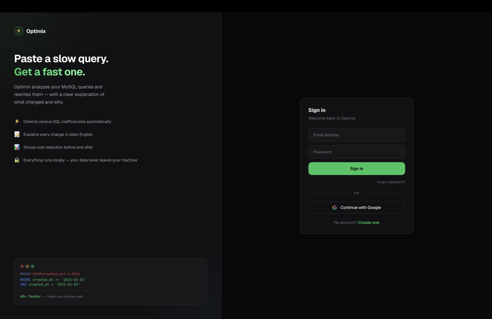
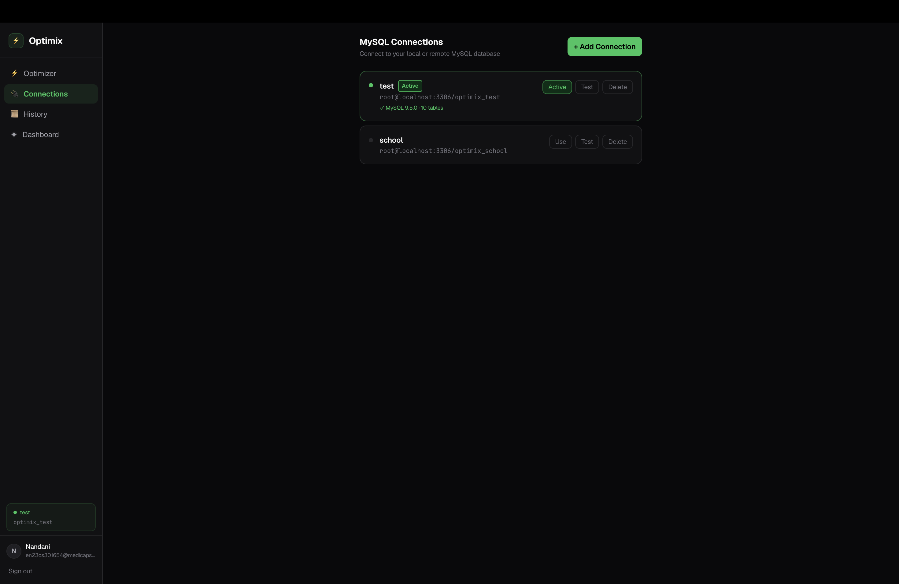
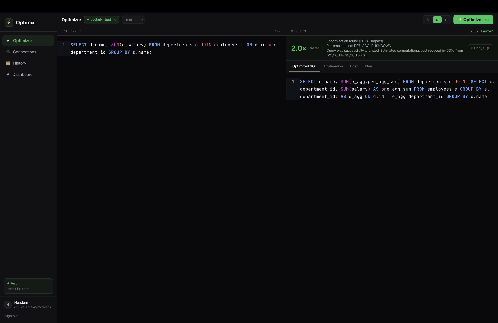
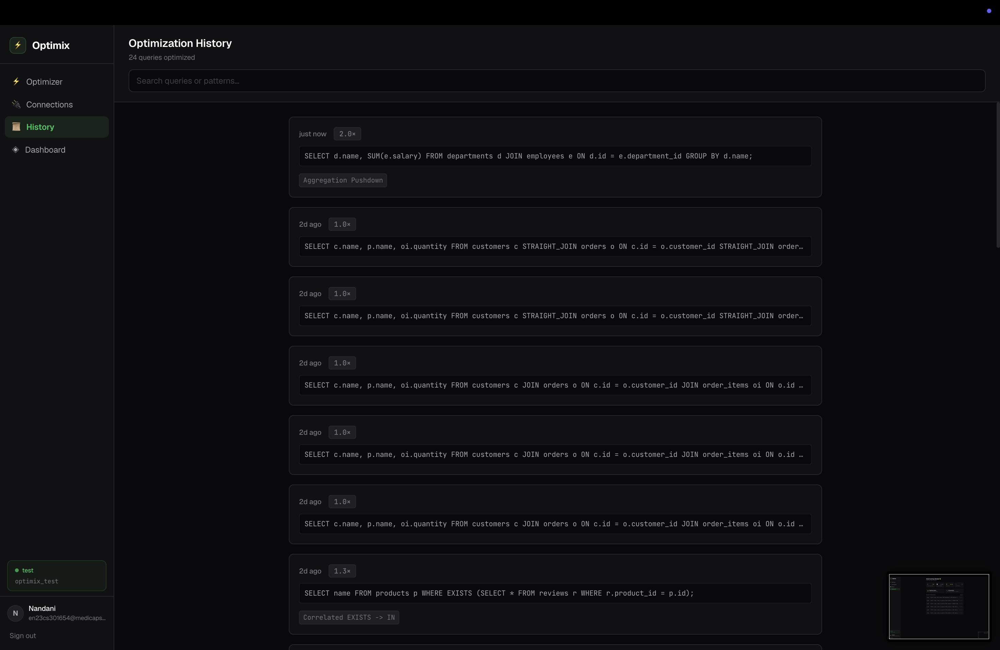
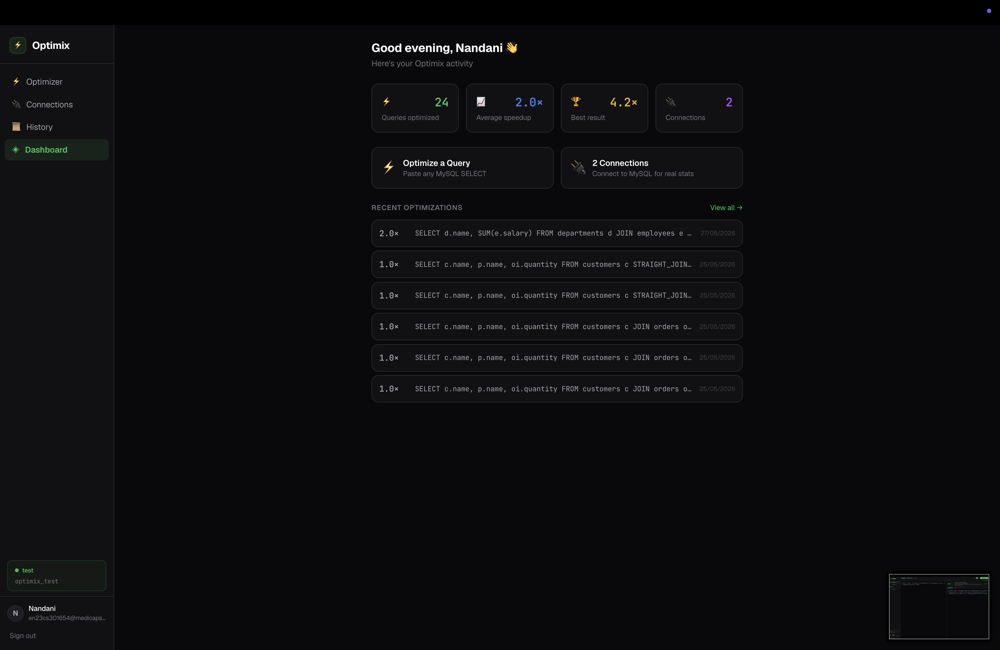

# Optimix: Intelligent SQL Query Optimizer

**Repository Link:** [https://github.com/nandani30/Optimix](https://github.com/nandani30/Optimix)

## Project Title and Brief Description
**Optimix** is a cross-platform desktop application designed to parse, analyze, and optimize complex SQL queries. It acts as a local SQL compiler tool, utilizing both rule-based transformations and cost-based algorithms to automatically rewrite inefficient queries and improve database execution plans. 

## Technology Stack and Tools Used
**Frontend (Desktop Client):**
* React + TypeScript
* Vite Bundler
* Electron (Packaged for Windows x64 & macOS arm64)

**Backend (Optimization Engine):**
* Java 17
* Javalin (Lightweight Web Framework)
* SQLite & JDBC (Embedded local storage)
* Maven (Build & Dependency Management)
* JSqlParser (SQL Abstract Syntax Tree parsing)

## Features and Functionalities Implemented
* **Multi-Tier Rule-Based Optimization:** Implements advanced SQL optimization patterns across three tiers, including Predicate Pushdown, Subquery Unnesting, Constant Folding, and Semi-Join Reductions.
* **Cost-Based Optimizer:** Evaluates multiple execution paths using a custom hardware-emulating cost calculator to determine the mathematically cheapest execution plan.
* **Live Execution Comparison:** Connects directly to local or remote MySQL databases to run `EXPLAIN` plans, comparing the computational cost of the original query vs. the optimized query.
* **Security & Authentication:** Manages secure user sessions via JWT and Google OAuth, utilizing Bcrypt for credential hashing.
* **Local-First Architecture:** Runs entirely offline using an embedded SQLite database for state management, ensuring user queries never leave their machine.

## Installation/Execution Steps to Run the Project
Optimix is distributed as a standalone desktop installer. No command-line setup or server configuration is required for the end user.

1. Navigate to the **Releases** section on the right side of this GitHub repository.
2. Download the appropriate installer for your operating system:
   * **Windows:** `Optimix Setup 1.0.0.exe`
   * **macOS (Apple Silicon):** `Optimix-1.0.0-arm64.dmg`
3. Install the application:
   * **Windows:** Double-click the `.exe` file to install and run.
   * **macOS:** Open the `.dmg` and drag the Optimix app into your Applications folder. 

**⚠️ Important Note for macOS Users:**
Because this is an independent project, it is not signed with a commercial Apple Developer Certificate. macOS Gatekeeper may initially prevent it from opening. To open the app:
1. Open your **Applications** folder.
2. **Right-click** (or Control-click) the Optimix app and select **Open**.
3. A warning dialog will appear. Click **Open** again. You will only need to do this the very first time you launch the app.
*(If macOS says the app is "damaged", open your terminal and run: `xattr -cr /Applications/Optimix.app` to clear the quarantine flag, then try again).*

*(For developers: To run from source, execute `mvn clean package` in the backend directory, followed by `npm install` and `npm run dev` in the frontend directory).*

## Team Members
* **Nandani Bhati**

## Project Screenshots/Output

### Landing & Secure Authentication

### Database Connection Management

### Intelligent Query Optimization (AST Rewriting)

### Optimization History

### Optimization Metrics

